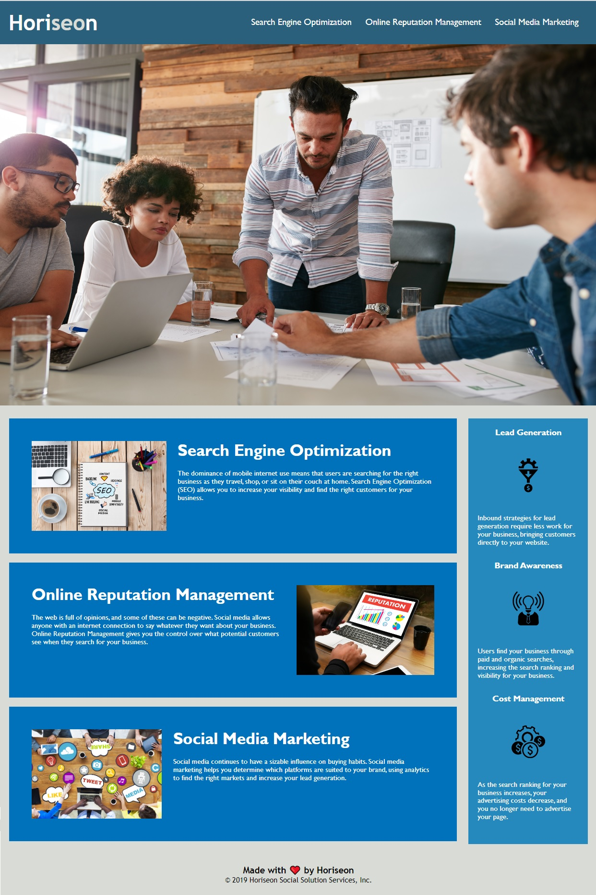

# Horiseon-accessibility

## Description

Code modification for bootcamp challenge to meet the accessibility criteria. 
The project was created to also optimize website for search engines.
The title element has been changed to a name of the company.
There were added or changed semantic HTML elements. 
Image elements got and 'alt' attribution and.

## Instalation

Link to website [HORISEON](https://pauli090.github.io/horiseon-accessibility/)

## Usage

Webpage has 3 links at the top, on the right side which take you to the adequate section on a site.

## Credits

I followed tutorials [w3schools](https://www.w3schools.com/html/default.asp)

Search for information about `alt` atribution [stackoverflow](https://stackoverflow.com/questions/14850187/is-it-correct-to-use-alt-tag-for-an-anchor-link)

## License 
MIT
